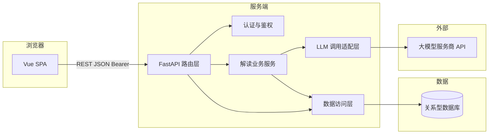

# 项目概要设计：老年友好型社保·医保·养老政策解读助手

## 1. 文档说明

| 项 | 内容 |
| --- | --- |
| 文档版本 | V1.1 |
| 依据文档 | `docs/项目需求分析.md`（V1.1） |
| 适用阶段 | 概要设计（接口形状、模块划分、前后端职责；不含具体 Prompt 全文与逐文件实现） |
| 关联参考 | `docs/项目实施流程与顺序.md` |

---

## 2. 设计目标与约束

| 目标/约束 | 说明 |
| --- | --- |
| 对齐需求 | 覆盖 F0～F5（见需求分析 V1.1） |
| 技术栈 | 前端 Vue（SPA）；后端 FastAPI；**关系型数据库**；服务端调用大模型（可选用 LangChain 编排） |
| 数据持久化 | **必须**：用户账号、密码哈希、解读历史记录（结构化结果 + 元数据；原文是否存见第 5.9 节） |
| 合规 | 解读结果结构化、可展示「原文未提及」类信息；界面固定免责声明（对应 F4）；历史数据按用户隔离 |

---

## 3. 系统上下文与逻辑架构

### 3.1 上下文（谁与谁交互）

```text
[用户浏览器] --HTTPS--> [Vue 前端静态资源]
[用户浏览器] --JSON/HTTPS--> [FastAPI 服务] --SQL--> [关系型数据库]
[FastAPI 服务] --HTTPS--> [大模型 API]
```

- 浏览器**不**直连大模型；API Key / 模型配置仅存在于服务端环境变量或安全配置中。
- 用户密码、解读记录仅存于**服务端数据库**，由 ORM/参数化查询访问，避免 SQL 注入。

### 3.2 逻辑架构图



### 3.3 职责划分

| 模块 | 职责 |
| --- | --- |
| Vue SPA | 注册/登录/登出界面、令牌存储与请求拦截器、路由守卫；解读主界面（输入、主题、结果、免责）；历史列表与详情 |
| FastAPI 路由 | 公开路由（注册、登录、健康检查）与**受保护路由**（解读、历史）；请求体验证、HTTP 状态与错误体、超时控制 |
| 认证与鉴权 | 校验 JWT（或等价）；解析 `user_id` 注入下游服务 |
| 解读业务服务 | 长度与字符策略、组装 Prompt、调用 LLM、解析 JSON、**写入解读历史**、失败降级与错误码 |
| 数据访问层 | 用户 CRUD（注册时写）、按 `user_id` 查询/分页历史、按 `id`+`user_id` 取单条详情 |
| LLM 适配层 | 统一 `invoke` 接口；便于替换供应商或接入 LangChain |

---

## 4. 前端概要设计（Vue）

### 4.1 页面与路由（信息架构）

采用 **Vue Router** 多路由结构（笔试仍可控在少量页面）：

| 路由（示例路径） | 内容 | 鉴权 |
| --- | --- | --- |
| `/login` | 登录表单、跳转注册链接 | 公开 |
| `/register` | 注册表单、跳转登录链接 | 公开 |
| `/` 或 `/explain` | 政策解读主界面：免责声明条、输入区、主题、生成按钮、结果卡片 | **需登录** |
| `/history` | 本人解读记录列表（时间、主题摘要、可点进详情） | **需登录** |
| `/history/:id` | 单条历史详情：展示已保存的结构化结果；若库中存有原文则展示 | **需登录** |

**路由守卫**：访问受保护路由时若无有效令牌，重定向至 `/login`；登录成功后可重定向回原目标页。

**主界面纵向分区**（在 `/explain` 内）：

| 区域 | 内容 | 对应需求 |
| --- | --- | --- |
| A. 页头 | 产品名称、当前用户标识、**登出**、**我的历史**入口 | F0 |
| B. 免责声明条 | 固定文案：阅读辅助、以当地最新政策及经办答复为准；**隐私提示**（含可能落库说明） | F4、F5 |
| C. 输入区 | 多行文本框；可选主题单选；字数提示与上限 | F1 |
| D. 主操作 | 「生成白话解读」按钮；禁用条件：空文本、超长、请求中 | F1、F3 |
| E. 状态区 | 加载中、错误信息与「重试」 | F3 |
| F. 结果区 | 多块卡片：摘要 / 条件 / 材料 / 渠道与时间 / 误读提醒 / 未覆盖事项 / 核实建议 | F2、F3 |

**适老化（概要级）**：登录页与主界面均保持基础字号 ≥ 16px（可配置）、行距舒适、主按钮大尺寸、对比度合理。

### 4.2 前端技术要点（非强制框架细节）

- HTTP 客户端：`fetch` 或 Axios；**请求拦截器**自动附加 `Authorization: Bearer <token>`（或 Cookie 方案，实现阶段二选一并在 README 固定）。
- 令牌存放：**内存 + sessionStorage** 或仅 **sessionStorage**（刷新可恢复）；避免把令牌写入可被第三方脚本随意读取的不可控位置（笔试阶段说明取舍即可）。
- 全局状态：可用轻量方案（如 `pinia`）存 `user` 概要字段与 `token`，或仅用组合式函数 + `ref`。

### 4.3 与后端的集成点

- Base URL：通过环境变量配置，例如 `VITE_API_BASE_URL`（开发默认 `http://localhost:8000`）。
- 调用第 **5** 章所列 API（认证、解读、历史）。

---

## 5. 后端概要设计（FastAPI）

### 5.1 服务边界

- 提供 **健康检查** 与 **政策解读** 两类接口。
- 不在服务端长期存储用户粘贴全文（与需求 5.3 一致）；日志中避免打印完整原文，必要时仅记录长度与哈希或截断。

### 5.2 路由一览

| 方法 | 路径 | 说明 |
| --- | --- | --- |
| `GET` | `/api/v1/health` | 存活探测；可返回版本号或 `{"status":"ok"}` |
| `POST` | `/api/v1/policy/explain` | 提交政策文本与可选主题，返回结构化解读 |

> 路径前缀 `/api/v1` 便于日后扩展；笔试单服务可保持简单。

### 5.3 请求体：`POST /api/v1/policy/explain`

| 字段 | 类型 | 必填 | 说明 |
| --- | --- | --- | --- |
| `text` | `string` | 是 | 用户粘贴的政策/通知正文 |
| `topic` | `string` | 否 | 主题标签，用于 Prompt 侧重；枚举见下表，缺省为 `general` |

**topic 枚举（与需求 F1.2 对齐）**

| 值 | 含义 |
| --- | --- |
| `general` | 社保综合 / 未区分 |
| `medical_insurance` | 医保 |
| `pension` | 养老保险 |

**校验规则（概要级）**

| 规则 | 建议阈值（实现可配置） | 错误码 |
| --- | --- | --- |
| 非空 trim 后长度 | ≥ 1 | `TEXT_EMPTY` |
| 最大长度 | 例如 8000～12000 字符（按模型上下文调整） | `TEXT_TOO_LONG` |
| 可选：控制不可见字符比例 | 实现阶段细化 | `TEXT_INVALID` |

### 5.4 成功响应体（结构化解读）

以下字段名供前后端对齐；**数组若无内容可返回 `[]`**，**不得用 null 表示「未生成」与「原文未写」混为一谈**——「原文未列」类语义放在对应字段的文案或 `notes` 中说明（与需求 F2.2、F2.3 一致）。

| 字段 | 类型 | 说明 |
| --- | --- | --- |
| `summary_one_line` | `string` | 一句话摘要 |
| `applicability` | `string[]` | 与我相关的条件（分条） |
| `materials` | `object` | 建议形状：`{ "items": string[], "source_note": string }`；原文未列材料时 `items` 可为 `[]` 且 `source_note` 标明 |
| `channels` | `string[]` | 办理方式与渠道（仅基于原文） |
| `important_dates` | `string[]` | 重要时间节点；无则可用一条说明「原文未提及明确时间」 |
| `common_misunderstandings` | `string[]` | 常见误读提醒；无则为 `[]` |
| `uncovered_points` | `string[]` | 原文未覆盖、建议向官方进一步确认的问题 |
| `verification_hints` | `string[]` | 建议核实途径类型（热线/窗口/政务 App 等），**不编造具体号码**（与 F2.4 一致） |

可选元数据（便于演示与排错，**勿存敏感原文**）：

| 字段 | 类型 | 说明 |
| --- | --- | --- |
| `model` | `string` | 实际使用的模型名（可配置） |
| `warnings` | `string[]` | 如「输出经 JSON 修复」等非致命提示 |

### 5.5 错误响应约定

统一 JSON 形状（HTTP 状态与 `code` 对应关系在实现时写死一张表即可）：

```json
{
  "error": {
    "code": "TEXT_TOO_LONG",
    "message": "人类可读说明"
  }
}
```

建议错误码集合（可扩展）：

| `code` | HTTP | 含义 |
| --- | --- | --- |
| `TEXT_EMPTY` | 400 | 文本为空 |
| `TEXT_TOO_LONG` | 400 | 超过长度上限 |
| `TEXT_INVALID` | 400 | 非法或不可解析输入 |
| `MODEL_TIMEOUT` | 504 | 上游模型超时 |
| `MODEL_UNAVAILABLE` | 502 | 上游不可用或配额错误 |
| `MODEL_OUTPUT_INVALID` | 502 | 模型返回无法解析为约定 JSON |
| `INTERNAL_ERROR` | 500 | 未预期错误 |

### 5.6 跨域与部署

- 开发环境：FastAPI 对 Vue 开发服务器来源开启 CORS（配置允许源列表）。
- 生产环境：同源部署（反向代理同域）或白名单 CORS；**HTTPS**（需求 5.3）。

### 5.7 配置项（环境变量，概要列表）

| 变量示例 | 用途 |
| --- | --- |
| `LLM_API_KEY` | 模型服务密钥 |
| `LLM_BASE_URL` / `LLM_MODEL` | 供应商端点与模型名 |
| `POLICY_TEXT_MAX_CHARS` | 输入最大字符数 |
| `LLM_TIMEOUT_SECONDS` | 单次调用超时 |
| `CORS_ORIGINS` | 允许的 Origin 列表 |

---

## 6. AI 子系统概要

### 6.1 位置与数据流

解读请求进入 `解读业务服务` 后：

1. 根据 `topic` 与系统规则组装 **System + User** 消息（或等价模板）。
2. 要求模型仅依据用户提供的 `text` 作答；**禁止编造**未出现在原文中的具体号码、日期、金额、地区政策版本。
3. 要求输出 **严格可解析的 JSON**，且键名与第 5.4 节一致（可在 Prompt 中附示例片段）。
4. 服务端对模型输出做 **JSON 解析**；失败则返回 `MODEL_OUTPUT_INVALID`，并可选择一次「修复型」重试（实现阶段决定）。

可选用 **LangChain** 承担：模板管理、输出 Parser、重试策略；非强制。

### 6.2 Prompt 策略（概要级）

| 策略 | 说明 |
| --- | --- |
| 角色设定 | 「政策阅读辅助」「面向老年人短句」「非官方解释」 |
| 硬规则 | 数字/日期/比例必须与原文一致或标注原文未提及；不得虚构联系方式 |
| 输出形态 | 单一 JSON 对象，字段完整；无信息用空数组与 `source_note` 说明 |
| 敏感兜底 | 若文本与社保医保养老无关，返回简短说明 + 尽量少的结构化空结果，或专用字段 `refusal_reason`（实现时二选一并在接口文档中固定） |

### 6.3 与需求 F5 的关系

本会话历史仅在前端实现即可，后端不提供历史查询接口。

---

## 7. 关键非功能设计对应

| 需求章节 | 概要设计对策 |
| --- | --- |
| 5.1 性能 | 后端 `LLM_TIMEOUT_SECONDS`；前端请求超时略大于后端；长文本限制 |
| 5.2 无障碍 | 前端：可见焦点、按钮与表单 `label`、错误文案可读 |
| 5.3 安全隐私 | 不落库、日志脱敏、HTTPS 部署 |
| 5.4 可维护 | 配置外置；LLM 适配层与路由分离 |

---

## 8. 验收对照（概要设计层）

| 需求验收项 | 概要设计落点 |
| --- | --- |
| AC1 稳定结构化结果 | 第 5.4 节字段集 + 第 6 节 JSON 策略 |
| AC2 缺失信息标注 | Prompt 硬规则 + `materials.source_note` / `uncovered_points` |
| AC3 适老化 | 第 4.1、4.2 节 |
| AC4 免责声明 | 第 4.1 节 B 区 + 可与结果区再次简短提示 |
| AC5 FastAPI + Vue | 第 3、4、5 节整体 |

---

## 9. 后续工作（超出本文档范围）

- OpenAPI（Swagger）由实现阶段从 FastAPI 自动生成或手写维护。
- Prompt 全文、单测与 CI、具体目录结构、Dockerfile 等见实现与 README。

---

*文档结束。*
