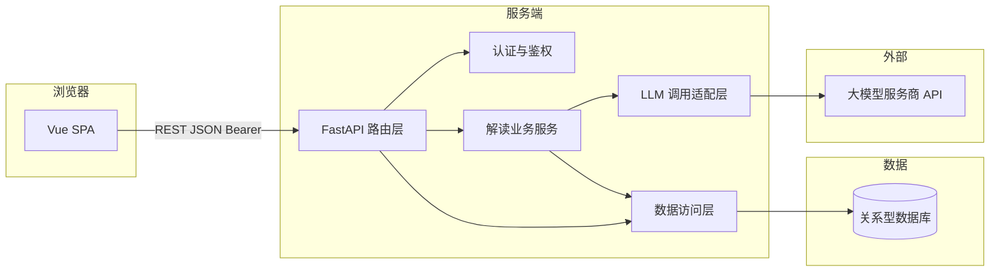

# 项目概要设计：老年友好型社保·医保·养老政策解读助手

## 1. 文档说明

| 项 | 内容 |
| --- | --- |
| 文档版本 | V1.3 |
| 依据文档 | `docs/项目需求分析.md`（V1.1） |
| 适用阶段 | 概要设计（接口形状、模块划分、前后端职责；不含具体 Prompt 全文与逐文件实现） |
| 关联参考 | `docs/项目实施流程与顺序.md`；**运行中的实现**：`policy-backend/`、`policy-frontend/` |

---

## 2. 设计目标与约束

| 目标/约束 | 说明 |
| --- | --- |
| 对齐需求 | 覆盖 F0～F5（见需求分析 V1.1） |
| 技术栈 | 前端 Vue（SPA）；后端 FastAPI；**关系型数据库**；服务端调用大模型（可选用 LangChain 编排） |
| 数据持久化 | **必须**：用户账号、密码哈希、解读历史（结构化 JSON + **原文全文**，见 `policy_explanations.input_text`） |
| 合规 | 解读结果结构化、可展示「原文未提及」类信息；界面固定免责声明（对应 F4）；历史数据按用户隔离 |

---

## 3. 系统上下文与逻辑架构

### 3.1 上下文（谁与谁交互）

```text
[用户浏览器] --HTTPS--> [Vue 前端静态资源]
[用户浏览器] --JSON/HTTPS--> [FastAPI 服务] --SQL--> [关系型数据库]
[FastAPI 服务] --HTTPS--> [大模型 API]
```

- 浏览器**不**直连大模型；API Key / 模型配置仅存在于服务端环境变量或安全配置中。
- 用户密码、解读记录仅存于**服务端数据库**，由 ORM/参数化查询访问，避免 SQL 注入。

### 3.2 逻辑架构图



### 3.3 职责划分

| 模块 | 职责 |
| --- | --- |
| Vue SPA | 注册/登录/登出界面、令牌存储与请求拦截器、路由守卫；解读主界面（输入、主题、结果、免责）；历史列表与详情 |
| FastAPI 路由 | 公开路由（注册、登录、健康检查）与**受保护路由**（解读、历史）；请求体验证、HTTP 状态与错误体、超时控制 |
| 认证与鉴权 | 校验 JWT（或等价）；解析 `user_id` 注入下游服务 |
| 解读业务服务 | 长度与字符策略、组装 Prompt、调用 LLM、解析 JSON、**写入解读历史**、失败降级与错误码 |
| 数据访问层 | 用户 CRUD（注册时写）、按 `user_id` 查询/分页历史、按 `id`+`user_id` 取单条详情 |
| LLM 适配层 | 统一 `invoke` 接口；便于替换供应商或接入 LangChain |

---

## 4. 前端概要设计（Vue）

### 4.1 页面与路由（信息架构）

采用 **Vue Router** 多路由结构（笔试仍可控在少量页面）：

| 路由（示例路径） | 内容 | 鉴权 |
| --- | --- | --- |
| `/login` | 登录表单、跳转注册链接 | 公开 |
| `/register` | 注册表单、跳转登录链接 | 公开 |
| `/` 或 `/explain` | 政策解读主界面：免责声明条、输入区、主题、生成按钮、结果卡片 | **需登录** |
| `/history` | 本人解读记录列表（时间、主题摘要、可点进详情） | **需登录** |
| `/history/:id` | 单条历史详情：展示已保存的结构化结果；若库中存有原文则展示 | **需登录** |

**路由守卫**：访问受保护路由时若无有效令牌，重定向至 `/login`；登录成功后可重定向回原目标页。

**主界面纵向分区**（在 `/explain` 内）：

| 区域 | 内容 | 对应需求 |
| --- | --- | --- |
| A. 页头 | 产品名称、当前用户标识、**登出**、**我的历史**入口 | F0 |
| B. 免责声明条 | 固定文案：阅读辅助、以当地最新政策及经办答复为准；**隐私提示**（含可能落库说明） | F4、F5 |
| C. 输入区 | 多行文本框；可选主题单选；字数提示与上限 | F1 |
| D. 主操作 | 「生成白话解读」按钮；禁用条件：空文本、超长、请求中 | F1、F3 |
| E. 状态区 | 加载中、错误信息与「重试」 | F3 |
| F. 结果区 | 多块卡片：摘要 / 条件 / 材料 / 渠道与时间 / 误读提醒 / 未覆盖事项 / 核实建议 | F2、F3 |

**适老化（概要级）**：登录页与主界面均保持基础字号 ≥ 16px（可配置）、行距舒适、主按钮大尺寸、对比度合理。

### 4.2 前端技术要点（非强制框架细节）

- HTTP 客户端：`fetch` 或 Axios；**请求拦截器**自动附加 `Authorization: Bearer <token>`（或 Cookie 方案，实现阶段二选一并在 README 固定）。
- 令牌存放：**内存 + sessionStorage** 或仅 **sessionStorage**（刷新可恢复）；避免把令牌写入可被第三方脚本随意读取的不可控位置（笔试阶段说明取舍即可）。
- 全局状态：可用轻量方案（如 `pinia`）存 `user` 概要字段与 `token`，或仅用组合式函数 + `ref`。

### 4.3 与后端的集成点

- Base URL：通过环境变量配置，例如 `VITE_API_BASE_URL`（开发默认 `http://localhost:8000`）。
- 调用第 **5** 章所列 API（认证、解读、历史）。

---

## 5. 后端概要设计（FastAPI）

### 5.1 服务边界

- 提供 **健康检查**、**注册/登录**、**当前用户**、**政策解读（鉴权）**、**解读历史（鉴权）**。
- 解读成功后将结构化结果与原文写入 **PostgreSQL**（`policy_explanations`）；日志勿打印完整 Bearer 与全文原文。

### 5.2 路由一览（已实现：`policy-backend/main.py`）

| 方法 | 路径 | 鉴权 | 说明 |
| --- | --- | --- | --- |
| `GET` | `/api/v1/health` | 无 | 存活探测 |
| `POST` | `/api/v1/auth/register` | 无 | 用户名 + 密码注册 |
| `POST` | `/api/v1/auth/login` | 无 | 登录，返回 JWT |
| `POST` | `/api/v1/auth/logout` | 无 | 占位（客户端清 token） |
| `GET` | `/api/v1/users/me` | Bearer | 当前用户 |
| `POST` | `/api/v1/policy/explain` | Bearer | 解读并落库 |
| `GET` | `/api/v1/policy/explanations` | Bearer | 历史列表 `limit`/`offset` |
| `GET` | `/api/v1/policy/explanations/{id}` | Bearer | 详情；非本人返回 404 |

### 5.3 请求体：`POST /api/v1/policy/explain`

| 字段 | 类型 | 必填 | 说明 |
| --- | --- | --- | --- |
| `text` | `string` | 是 | 政策/通知正文 |
| `topic` | `string` | 否 | `general` / `medical_insurance` / `pension`，默认 `general` |

**校验**：空文本、超长（`POLICY_TEXT_MAX_CHARS`）返回 400。

### 5.4 成功响应体（结构化解读）

响应在业务字段基础上增加顶层 **`record_id`**（数据库主键）。其余字段与需求 4.4.1 一致：

| 字段 | 类型 | 说明 |
| --- | --- | --- |
| `record_id` | `string` | 历史记录 ID |
| `summary_one_line` | `string` | 一句话摘要 |
| `applicability` | `string[]` | 与我相关的条件 |
| `materials` | `object` | `{ "items": string[], "source_note": string }` |
| `channels` | `string[]` | 办理渠道 |
| `important_dates` | `string[]` | 时间节点 |
| `common_misunderstandings` | `string[]` | 易误读提醒 |
| `uncovered_points` | `string[]` | 原文未覆盖 |
| `verification_hints` | `string[]` | 核实途径类型 |
| `model` | `string` \| `null` | 模型名或 `mock` |
| `warnings` | `string[]` | 非致命提示 |

### 5.5 错误响应

当前实现以 FastAPI 默认 **`detail` 字符串** 为主（笔试优先跑通）；若需统一 `{ "error": { "code", "message" } }` 可后续加异常处理器。

### 5.6 跨域与部署

- CORS 由 `CORS_ORIGINS` 控制（默认 `*` 便于本地 Vue 联调）。
- 生产环境建议 **HTTPS** 与收紧 Origin。

### 5.7 配置项（环境变量）

见 `policy-backend/.env.example`。LLM 相关键名为 **`OPENAI_API_KEY`**、**`OPENAI_BASE_URL`**、**`OPENAI_MODEL`**（OpenAI 兼容接口）；未配置 Key 时走内置 mock。

---

## 6. AI 子系统概要

### 6.1 位置与数据流

解读请求在 `policy-backend/routers/policy.py` 中进入服务逻辑后：

1. 根据 `topic` 与系统规则组装 **System + User** 消息（见 `services/explain_llm.py`）。
2. 要求模型仅依据用户提供的 `text` 作答；**禁止编造**未出现在原文中的具体号码、日期、金额、地区政策版本。
3. 要求输出 **严格可解析的 JSON**，且键名与第 **5.4** 节（除 `record_id` 外）一致。实现代码：`policy-backend/services/explain_llm.py`。
4. 服务端对模型输出做 **JSON 解析**；失败时可返回 502（当前实现由 OpenAI SDK 抛错映射为 500，可再细化）。

可选用 **LangChain** 承担：模板管理、输出 Parser、重试策略；非强制。

### 6.2 Prompt 策略（概要级）

| 策略 | 说明 |
| --- | --- |
| 角色设定 | 「政策阅读辅助」「面向老年人短句」「非官方解释」 |
| 硬规则 | 数字/日期/比例必须与原文一致或标注原文未提及；不得虚构联系方式 |
| 输出形态 | 单一 JSON 对象，字段完整；无信息用空数组与 `source_note` 说明 |
| 敏感兜底 | 若文本与社保医保养老无关，返回简短说明 + 尽量少的结构化空结果，或专用字段 `refusal_reason`（实现时二选一并在接口文档中固定） |

### 6.3 与需求 F5 的关系

解读历史由 **后端持久化**（`policy_explanations` 表）并提供列表/详情接口；实现见 `policy-backend/routers/policy.py`。前端负责展示与导航。

---

## 7. 关键非功能设计对应

| 需求章节 | 概要设计对策 |
| --- | --- |
| 5.1 性能 | 后端 `LLM_TIMEOUT_SECONDS`；前端请求超时略大于后端；长文本限制 |
| 5.2 无障碍 | 前端：可见焦点、按钮与表单 `label`、错误文案可读 |
| 5.3 安全隐私 | 密码哈希、JWT、按用户隔离历史、HTTPS；原文落库见需求 F5 |
| 5.4 可维护 | 配置外置；LLM 适配层与路由分离 |

---

## 8. 验收对照（概要设计层）

| 需求验收项 | 概要设计落点 |
| --- | --- |
| AC1 稳定结构化结果 | 第 5.4 节字段集 + 第 6 节 JSON 策略 |
| AC2 缺失信息标注 | Prompt 硬规则 + `materials.source_note` / `uncovered_points` |
| AC3 适老化 | 第 4.1、4.2 节 |
| AC4 免责声明 | 第 4.1 节 B 区 + 可与结果区再次简短提示 |
| AC5 FastAPI + Vue + 数据库 | `policy-backend` + `policy-frontend` + PostgreSQL |
| AC6 / AC7 | 注册登录与历史隔离：见 `dependencies` + `policy_router` |

---

## 9. 后续工作（超出本文档范围）

- OpenAPI（Swagger）由实现阶段从 FastAPI 自动生成或手写维护。
- Prompt 全文、单测与 CI、具体目录结构、Dockerfile 等见实现与 README。

---

*文档结束。*
